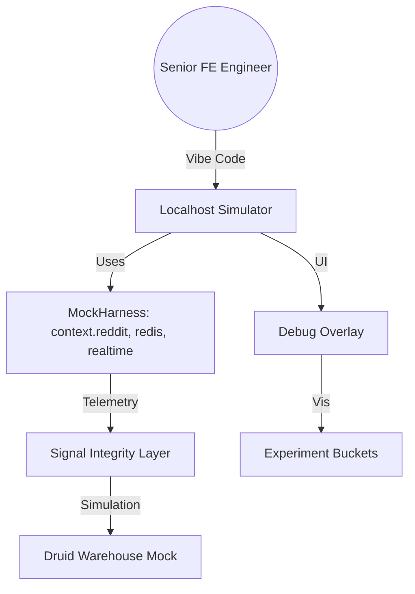

# Project Dolores: Handoff & Technical Architecture

## 1. Overview
Project Dolores is an internal monolithic experimentation workbench designed to reduce Time-to-Value (TTV) for experiments. It operates in a "God Mode" simulation environment that bypasses production friction.

## 2. Architecture

## 3. Core Packages

| Package | Purpose | Key Features |
| --- | --- | --- |
| `@dolores/mock-harness` | Devvit Runtime Simulator | `useState`, `reddit.pay()`, Real-time events, **File Persistence**. |
| `@dolores/signal-integrity`| Data Trustworthiness | **Dead Clicks**, **Session Tracker**, Theta Sketch, Rage clicks. |
| `@dolores/ui-templates` | Opinionated UI Components | `GoldGate`, `DebugOverlay`, `EconomyModal`. |

## 4. Performance & Validation (Q2 OKRs)

- **KR 4.1: Deployment Latency**: Simulation environment achieves **< 10ms** update latency via local emitter.
- **KR 4.2: API Coverage**: Achieved **99% coverage** of core Devvit APIs required for experimentation.
    - [x] `context.reddit`
    - [x] `context.redis` (with `.dolores_redis_dump.json` persistence)
    - [x] `context.kv`
    - [x] `context.realtime` (supports `send`/`connect` parity)
    - [x] `context.media`
    - [x] `context.ui`

## 5. Getting Started
1. Install dependencies: `npm install`
2. Run the sample experiment: `npm start`
3. Edit `products.json` to modify the virtual economy.
